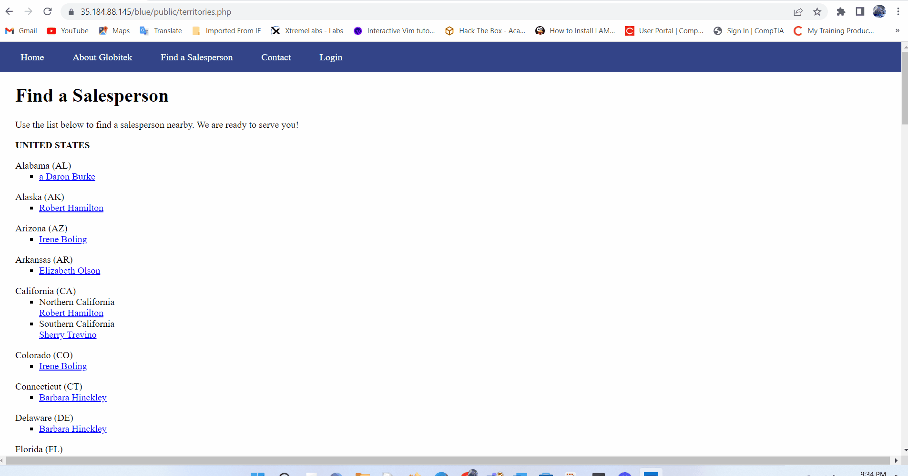
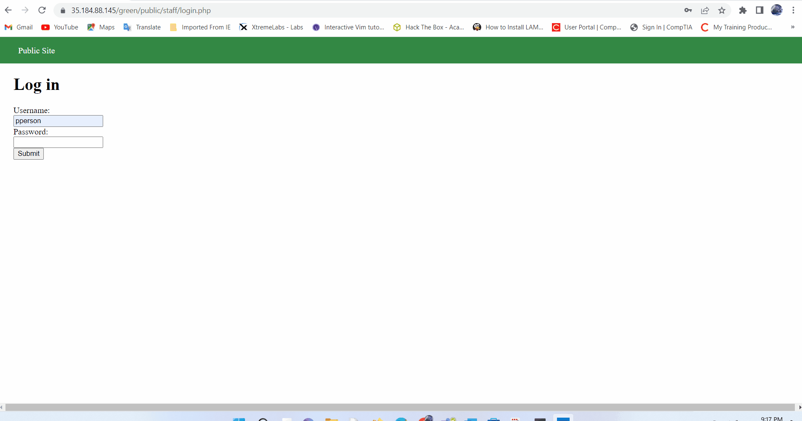
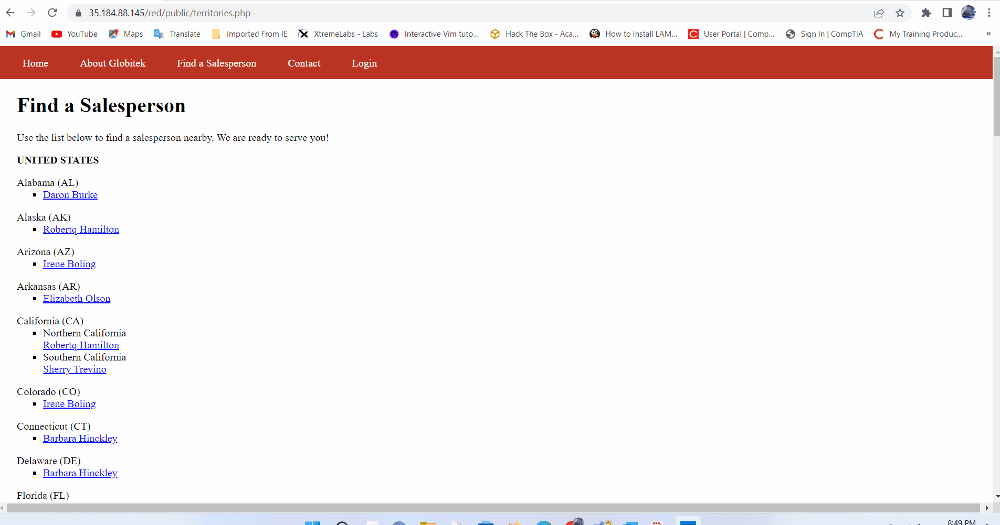

# Pen Testing Live Targets

Time spent: 5 hours spent in total

> Objective: Identify vulnerabilities in three different versions of the Globitek website: blue, green, and red.

The six possible exploits are:

* Username Enumeration
* Insecure Direct Object Reference (IDOR)
* SQL Injection (SQLi)
* Cross-Site Scripting (XSS)
* Cross-Site Request Forgery (CSRF)
* Session Hijacking/Fixation

Each color is vulnerable to only 2 of the 6 possible exploits. First discover which color has the specific vulnerability, then write a short description of how to exploit it, and finally demonstrate it using screenshots compiled into a GIF.

## Blue

Vulnerability #1: SQL INJECTION
Description:  SQL Injection Under the salesperson page 
the user can perform an attack by adding a SQL injection to the end of the URL, when adding ' OR SLEEP(5)=0--' to the end of the URL, the website shows a different staff member's profile, indicating that it responded to the SQL that was added. The mistake the developer made was not sanitizing the URL input.

## Green

Vulnerability #1: ______USER NAME ENUMERATION____________

Description: The Website has the Username Enumeration error where the failure to login message differs for the Username that exists vs doesn't exist. The user which exist in the system is bold and which doesn not exist is not bold

## Red

Vulnerability #1: ________IDOR__________

Description: GIF show an attacker getting access to the hidden user's accounts that the attacker is not permitted to view.
 This is done through modifying the "id" parameter in the URL's to change the GET request. The attacker can access 2 hidden accounts
 1. Testy McTesterson (NOT PUBLIC UNTIL SEPT. 1)
987-654-3210
testy@globitek.com
2. Lazy Lazyman (FIRED FOR STEALING)
321-432-9876
lazyman@globitek.com

## Notes

Describe any challenges encountered while doing the work
